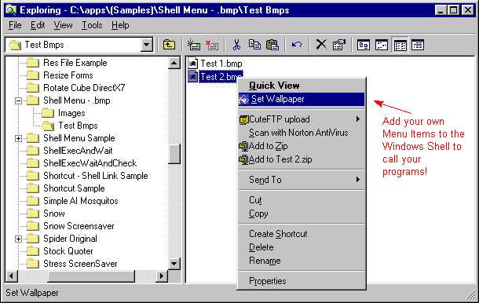



## Windows Shell Extension \- Bitmap Context Menu Demo

### Description

This Sample program shows how to add Context Menu Shell Extensions to Windows for specific file types that you specify. When you right click on a .zip file, have you noticed that there is a menu item to Load WinZip. Well, you can write your own menu extensions for file types in windows too! This is Advanced code, but there is a good ReadMe.txt file that explains what you need to know to use and modify the code for your purposes.
 
### More Info
 

             |
---                |---
**Submitted On**   |2000-03-30 11:43:52
**By**             |[Drew](https://github.com/Planet-Source-Code/PSCIndex/blob/master/ByAuthor/drew.md)
**Level**          |Advanced
**User Rating**    |5.0 (45 globes from 9 users)
**Compatibility**  |VB 5\.0, VB 6\.0
**Category**       |[Windows API Call/ Explanation](https://github.com/Planet-Source-Code/PSCIndex/blob/master/ByCategory/windows-api-call-explanation__1-39.md)
**World**          |[Visual Basic](https://github.com/Planet-Source-Code/PSCIndex/blob/master/ByWorld/visual-basic.md)
**Archive File**   |[CODE\_UPLOAD44093302000\.zip](https://github.com/Planet-Source-Code/drew-windows-shell-extension-bitmap-context-menu-demo__1-6902/archive/master.zip)

